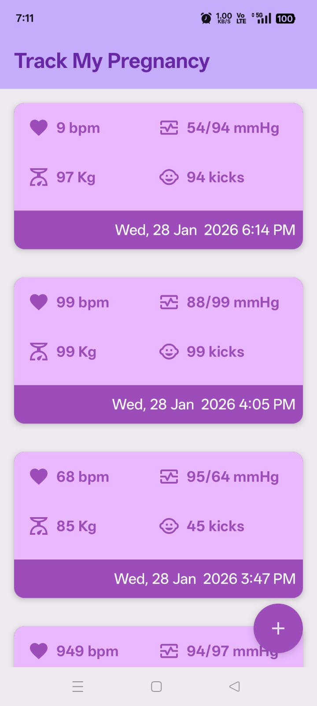
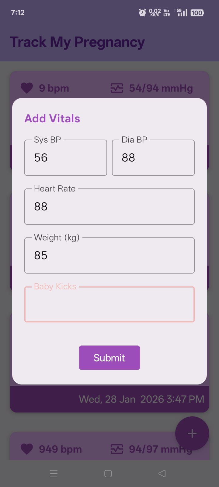

🩺 VitalTrack – Pregnancy Vitals Tracker

VitalTrack is a modern Android application designed to help expecting mothers log, track, and manage pregnancy-related vitals with timely reminders.
Built using Kotlin, Jetpack Compose, and modern Android architecture components.

✨ Features

Log pregnancy vitals:
Blood Pressure (Systolic / Diastolic)
Heart Rate
Weight
Baby Kicks Count
Live list updates using StateFlow / LiveData
Clean & intuitive UI with Jetpack Compose
Reminder notifications using WorkManager
High-priority notifications that open the app on tap
Offline-first with local persistence 

🧱 Tech Stack

Kotlin
Jetpack Compose
MVVM Architecture
Room Database
WorkManager
Material 3
KSP

📸 Screenshots – App UI

| Home Screen | About Screen |
|  |  |

🛠️ How to Run the Project
Clone the repository:
https://github.com/Manash396/VitalsTrack.git